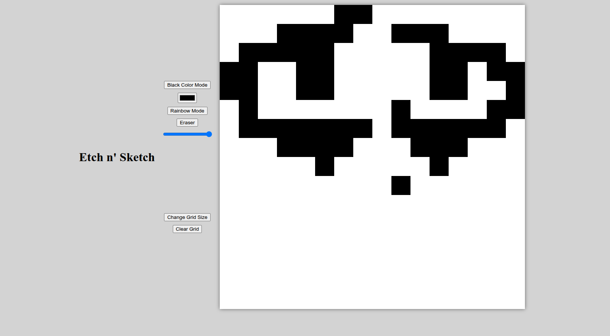
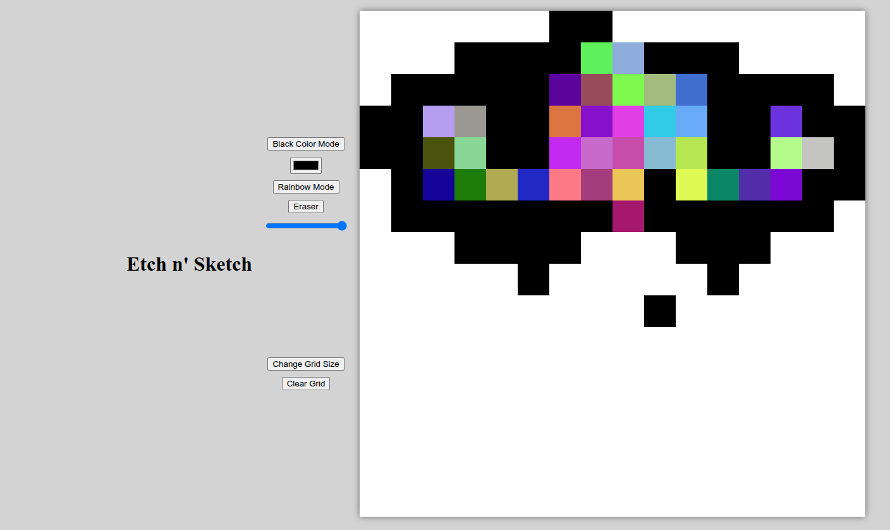
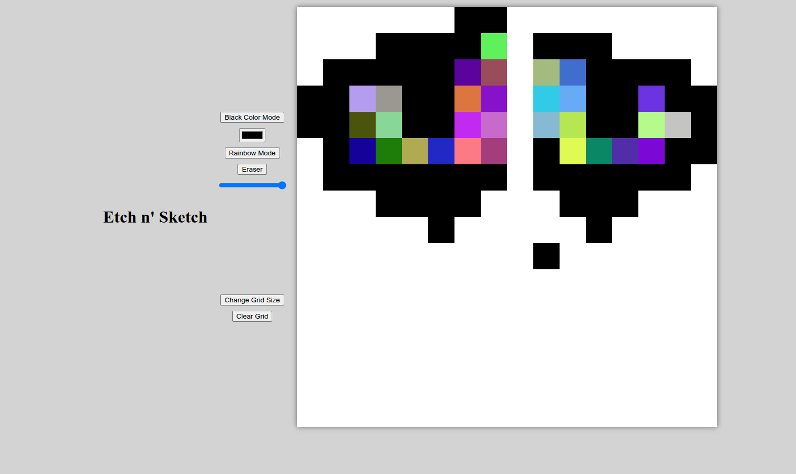
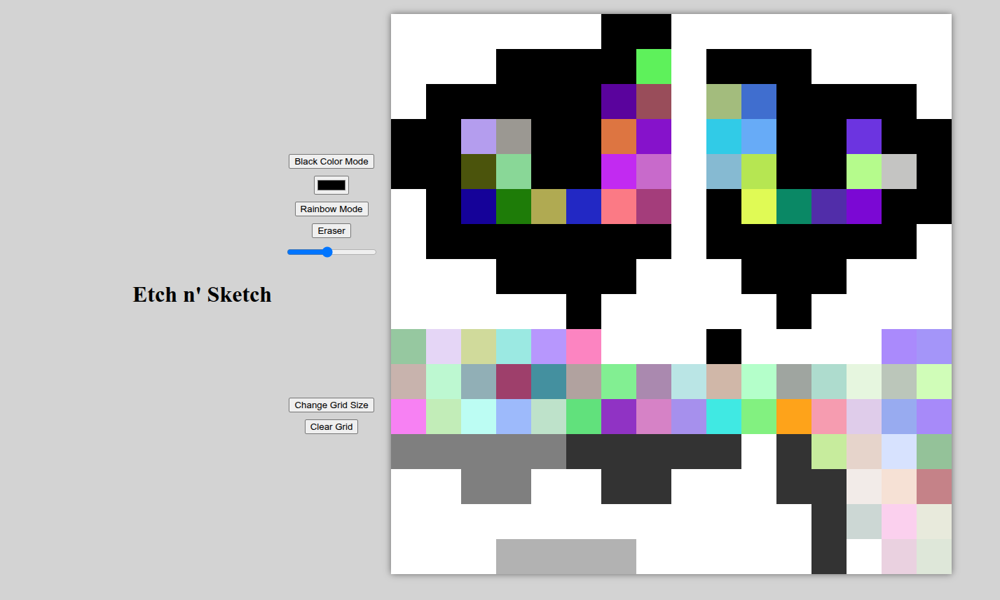

# Etch'n'sketch

Project created for [Project Odin]((https://www.theodinproject.com/lessons/foundations-etch-a-sketch))

## Features 

Functioning etch'n'sketch in which you can draw and change size of canvas.

By default black mode is enabled.

You can change color or even enter rainbow mode in which color changes every pixel.

To erase mistakes click erase button.

To change opacity of your brush move the slider.

To change grid size click "Change grid size" button. Alert will pop up and then input your prefered size. Be aware that this clears canvas!

## Live Preview 

To see this website live click this [Link](https://devoid-of-thought.github.io/odin-etch-n-sketch/).